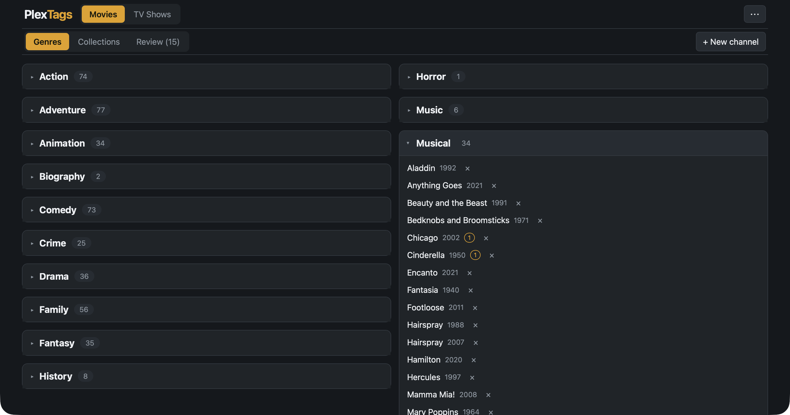
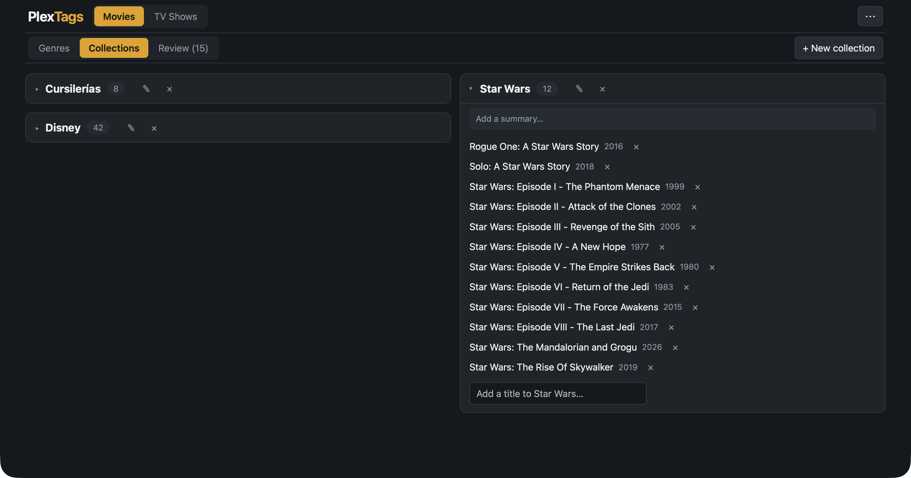

# PlexTags

A local web app that cleans up the **genre tags** and **collections** in a Plex
library. It shows the library as a TV-style *channel lineup*: each genre is a
channel, and every movie or show with that tag is a title in the channel. You
edit the channels, review the queued changes, and push them all to Plex in one
save.



Everything runs on your own machine and talks directly to your Plex Media
Server. Nothing is sent anywhere else.

## Why it exists

Plex's metadata agents assign genres generously and inconsistently. *DuckTales*
comes back tagged "Science Fiction" and "Action", and *The Americans* picks up
"Mystery". The Plex UI can only fix one title at a time, and it cannot show a
genre as a group. PlexTags inverts the view: you open the "Mystery" channel,
find the titles that do not belong, and pull them out.

When PlexTags writes a change, it also sets `genre.locked=1` on the item. Then
the Plex agents do not overwrite your correction on the next metadata refresh.

## Features

- **Genre channels** — see every genre as a group, add and remove titles, or
  create new genres.
- **Collections** — the same workflow for Plex collections, plus create,
  rename, summary edits, and delete.
- **Staged edits** — every change queues in a tray. Nothing touches Plex until
  you press Save, and one Save applies everything.
- **Wikipedia suggestions** — compare your genres against Wikidata and
  Wikipedia, and accept or dismiss each suggestion.
- **Locked corrections** — each write locks the field, so Plex agents keep
  your changes.
- **Offline browsing** — read the cached library without a Plex sign-in.

## Install

You need `uv` and `npm`:

```bash
brew install uv node    # macOS; on Linux, install uv and Node.js your usual way
git clone https://github.com/<you>/plextags.git
cd plextags
```

## Run

```bash
bin/dev
```

The script installs the missing Python and npm dependencies, starts both
servers with tagged output, and prints the URL to open. Ctrl-C stops
everything.

```
bin/dev          both servers
bin/dev --api    backend only
bin/dev --web    frontend only
```

Under the hood there are two processes: the FastAPI backend on port **8998**
and the Vite dev server on port **5173**. Vite proxies `/api` to the backend,
so **open http://localhost:5173** — not 8998. The backend does not serve the
frontend. To run them by hand:

```bash
uv run uvicorn server.main:app --port 8998   # terminal 1
npm run dev --prefix web                      # terminal 2
```

## First-time setup

1. Open http://localhost:5173 and click **Sign in with Plex**. A plex.tv tab
   opens for the PIN approval. There is no token to copy.
2. Pick a server. The app lists the servers on your account and tests each
   connection, with local connections first.
3. Click **Download library**. The app pulls every movie (or show), with its
   genres and collections, into a local cache. This is a per-item fetch, so it
   takes a moment and shows progress.

## Usage

### Genres

Open a channel to see its titles. The × on a row queues a removal. The input
at the bottom of a channel adds a title. **+ New channel** creates a genre.
Click a title to edit all of its genres and collections in one modal.

The tray at the bottom shows every queued change. **Save to Plex** writes them
all, then re-downloads the library, so the app shows what actually stuck.

### Collections



The **Collections** tab lists each collection in the section as a card. The
cards work like genre channels, with more controls:

- Add and remove titles with the same staged edits as genres.
- **+ New collection** stages a new collection. Plex creates it when the first
  member is saved, so a staged collection with no members is dropped at Save.
- The ✎ button renames a collection. A rename keeps the poster, the members,
  and the sort order.
- Click the summary text to edit it.
- The × button on a card stages a delete. The card stays visible with an undo
  until you save. CAUTION: A saved delete is permanent on Plex.

Smart collections show a "smart" badge and are read-only. The tray shows
collection changes with a ⊞ prefix, next to the genre changes, and one Save
applies everything.

### Suggestions from Wikipedia

Click **Refresh evidence** in the ⋯ menu once. In about 40 seconds for a few
hundred titles, PlexTags downloads what Wikidata and the English Wikipedia say
about every title's genre. After that everything is local.

Each title then shows suggested additions and removals, with the Wikipedia
lead sentence next to them, so you can judge instead of trust. **Accept**
queues the change into the normal tray. **Dismiss** hides that suggestion for
good. The **Review** tab walks through every title with open suggestions.

The suggestions are deliberately conservative. An addition needs both sources
to agree. A removal needs both sources present, specific, and silent on the
tag. A removal is never offered if it would leave a title with no genres, or
for genres that Wikidata does not record (Wikidata calls *Cars* "buddy,
comedy, flashback" and never "family film", which does not make Family wrong).

## Privacy and data

- The app talks to your Plex server and, for suggestions, to the public
  Wikidata and Wikipedia APIs. It sends only IMDb ids and article titles to
  those APIs — never your Plex token or account data.
- Your Plex token and all caches stay in `data/`, which is gitignored.
- TLS verification is off for the Plex server connection, because local
  servers use plex.direct or self-signed certificates. This app is meant for
  LAN use.

## The original CLI

`plex_genres.py` is the standalone script the web app grew out of. It has zero
dependencies — a bare `python3` runs it. It is useful for a quick export or a
scripted bulk edit. It handles genres only, not collections.

```bash
export PLEX_URL="http://192.168.1.50:32400"
export PLEX_TOKEN="xxxxxxxxxxxxxxxxxxxx"

python3 plex_genres.py sections                       # find your section IDs
python3 plex_genres.py export --section 1 --kind movie # -> plex_movies.{csv,json}
python3 plex_genres.py export --section 2 --kind show  # -> plex_shows.{csv,json}

python3 plex_genres.py apply --section 2 --kind show \
    --file corrections.json --dry-run                  # preview
python3 plex_genres.py apply --section 2 --kind show --file corrections.json
```

To get a token: sign in at app.plex.tv, open any movie → "..." → Get Info →
View XML. The token is the `X-Plex-Token=` value in that URL.

### corrections.json format

A list of objects, each keyed by `ratingKey`. Use `remove` and/or `add`, or
`set` to replace the whole genre list:

```json
[
  {"ratingKey": "2144", "title": "DuckTales", "remove": ["Science Fiction", "Action"]},
  {"ratingKey": "5678", "title": "Some Movie", "add": ["Comedy"], "remove": ["Horror"]},
  {"ratingKey": "9012", "title": "Another", "set": ["Action", "Adventure"]}
]
```

## What's in the repo

```
bin/dev               dev launcher — installs deps, runs both servers
plex_genres.py        standalone CLI (stdlib only) — the original tool

server/               FastAPI backend
  main.py             HTTP routes; background refresh jobs
  plex.py             Plex API client (auth, discovery, fetch, edits)
  evidence.py         Wikidata/Wikipedia genre evidence, batched and cached
  store.py            local JSON persistence in data/
web/                  React + TypeScript + Vite frontend
  src/App.tsx         top-level state and screen routing
  src/api.ts          typed fetch wrappers for the backend
  src/state/edits.ts  pending-edit model and the tag->channel grouping
  src/state/collections.ts  staged collection operations and their rules
  src/views/          Auth, Lineup, Collections, TitleEditor, EditsTray
study/                offline audit of Plex genres vs Wikidata/Wikipedia

data/                 gitignored: config.json (client id, Plex token, chosen
                      server) and library_<section>.json caches
docs/                 screenshots for this README
```

The CLI writes its exports (`plex_movies.{csv,json}`, `plex_shows.{csv,json}`)
and reads its correction batches (`corrections.json`) at the repo root. Those
files describe your library, so they are gitignored. If the JSON exports are
present, the web app uses them to seed its cache before the first Refresh.

## License

MIT — see [LICENSE](LICENSE).
